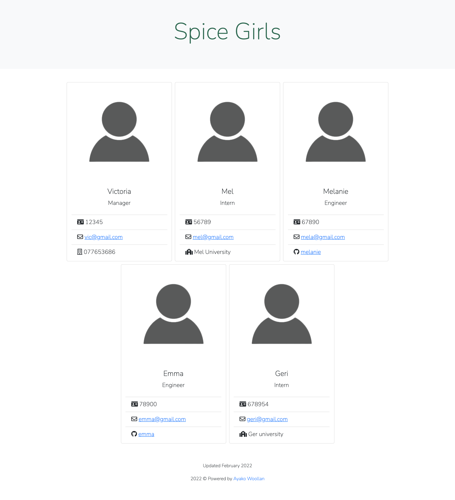

---
  
# Team Profile Generator

  

Table of Contents

  
<ol>
  
<li>
  
<a href="#about-the-project">About The Project</a></li>

  
<ul>
  
<li><a href="#built-with">Built With</a></li>

<li><a href="#usage">Usage</a></>
</ul>

</li>

<li>

<a href="#getting-started">Getting Started</a>

<ul>

<li><a href="#installation">Installation</a>

</ul>

</li>
<li><a href="#license">License</a></>
  
<li><a href="#contact">Contact</a></>
  
</ol>
  

 ## About The Project

 

This is a a Node.js command-line application that takes in information about employees on a software engineering team, then generates an HTML webpage that displays summaries for each person. Testing is key to making code maintainable, so you’ll also write a unit test for every part of your code and ensure that it passes each test.

(<a href="#top">back to top</a>)</>

 ## Built With
* [Node.js](https://nodejs.org/) 
* [Inquirer package](https://www.npmjs.com/package/inquirer) 
* [Jest package](https://www.npmjs.com/package/jest)  
* HTML  

 (<a href="#top">back to top</a>)</>

## Usage

  Following image shows this application's functionality(questions).

(<a href="#top">back to top</a>)</>

## Getting Started

To get a local copy up and running follow these simple example steps.

 ## Installation

 The application will be invoked by using the following command:

  `git clone git@github.com:ayacomputer/10-Team-Profile-Generator.git`

(<a href="#top">back to top</a>)</>

## License

Distributed under MIT License.

See LICENSE.txt for more information.

(<a href="#top">back to top</a>)</>

 ## Contact Me

Ayako Woollan - ayako.woollan@gmail.com

Project Link: [https://github.com/ayacomputer/10-Team-Profile-Generator](https://github.com/ayacomputer/10-Team-Profile-Generator)

(<a href="#top">back to top</a>)</>
